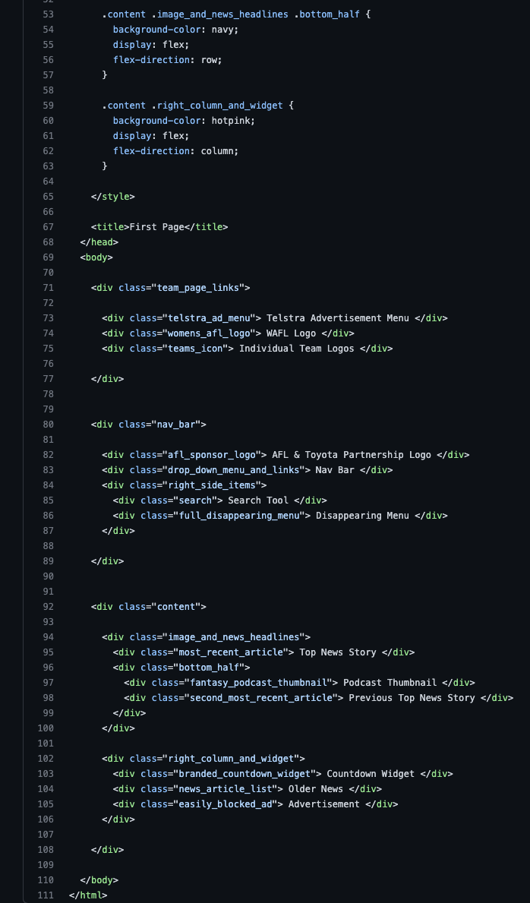
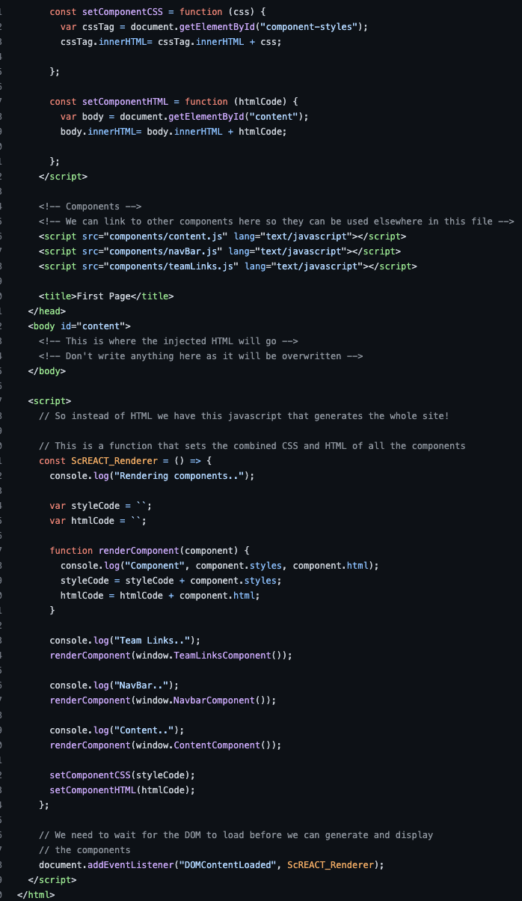
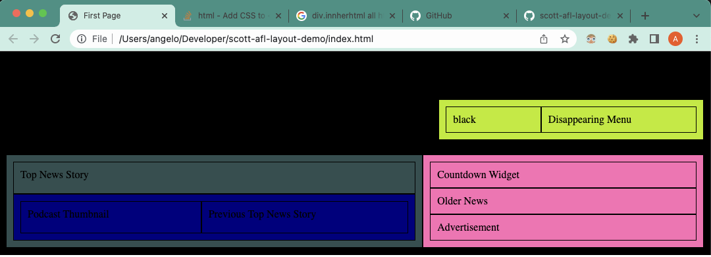

# AFL Layout Prototype

View live layout:

> https://scotty-wkc.github.io/afl-layout-demo/

---

# Part 2

## We have finally created a new replacement to the aging "React" tool called

# 🔥 ScREACT V1.0 🧨

It's pretty amazing and definetely will take over the entire internet soon.

We went from this... 👨🏼‍🌾

TO THIS ☄️

Great isnt it?!

Unfortunately... Ive buggered up a few bits so good luck with fixing that! ..

Haha.. this doesnt look right at all 😅

---

> old stuff ignore:

# Part 1

Based on
https://www.afl.com.au

## HTML - Building blocks

- html
  - head
  - meta
  - meta
  - style
  - title
  - body
    - team page links
      - Telstra ad menu
      - Womens afl logo
      - Teams icons
    - nav bar
      - AFL sponsor logo
      - drop down menu and links
      - Right side items
        - Search
        - full disappearing menu
    - content
      - image and news headlines
        - most recent article
        - bottom half
          - Fantasy podcast thumbnail
          - 2nd most recent article
      - Right column and widget
        - Branded countdown widget
        - News article list
        - easily blocked ad

### CSS - Design, prettiness

### Javascript - Functionality
